# LocateCEP: Localizador de UF/Cidade via Cep

O LocateCEP é um componente criado para simplificar o processo de obtenção de informações sobre o estado brasileiro (
UF) e a cidade associados a um CEP específico. Ele é um sistema que utiliza um banco de dados para realizar consultas e
fornecer essas informações de forma rápida e eficiente.

O desenvolvimento do LocateCEP surgiu da necessidade de facilitar e agilizar a recuperação de informações geográficas
com base em um CEP. Muitas vezes, ao lidar com sistemas de logística, entrega de mercadorias ou simplesmente
preenchimento de formulários, é essencial ter acesso rápido e preciso às informações de UF e cidade associadas a um
determinado CEP. O LocateCEP visa resolver esse problema, fornecendo uma maneira fácil e confiável de obter esses
dados.

Sem um sistema dedicado como o LocateaCEP, obter informações de estado e cidade a partir de um CEP pode ser um processo
complexo e demorado, envolvendo consultas manuais em bancos de dados ou APIs externas. Em muitos cenários, especialmente
em sistemas em tempo real ou aplicativos que exigem respostas rápidas, é crucial ter um mecanismo que forneça essas
informações de forma rápida e eficiente.

## Uso:

Para utilizar o sistema, você precisa executar o arquivo JAR gerado a partir do código fonte. Passe o número do CEP desejado como argumento na linha de comando.
Exemplo:

### Exemplo: Aplicativo de Entregas

Exemplos mais práticos de como o sistema poderia ser utilizado.

1. - Um cliente insere seu CEP em um aplicativo de entrega, por exemplo, `cep: 12345-678`.

2. - O aplicativo valida o CEP fornecido.

3. - Se o CEP for válido, o sistema utiliza um serviço para buscar informações relacionadas ao CEP, como estado e cidade.

4. - Com base nessas informações, o aplicativo atribui a entrega a um centro de distribuição mais próximo.

5. - O pedido é então encaminhado para entrega, otimizando o processo e reduzindo tempos de espera e custos de envio.

Exemplo de Implementação:

```bash
java -jar locatecep.jar 12345678 
```


```java
public class Main {
   public static void main(String[] args) {
      // Verifica se exatamente um argumento (o CEP) foi fornecido na linha de comando
      if (args.length != 1) {
         // Exibe uma mensagem indicando o uso correto do programa
         System.err.println("Uso: java -jar locatecep.jar <NUMERO DO CEP>");
         // Encerra o programa com um código (1)
         System.exit(1);
      }

      // Obtém o número do CEP do primeiro argumento
      String numeroCep = args[0];

      // Cria uma instância da classe CepView para interação com o usuário
      CepView view = new CepView();

      // Cria uma instância do repositório que busca dados no banco de dados
      CepRepository repository = new DatabaseCepRepository();

      // Cria uma instância do serviço de CEP, passando o repositório como dependência
      CepService cepService = new CepService(repository);

      try {
         // Tenta buscar as informações do CEP usando o serviço
         Cep cep = cepService.buscar(numeroCep);
         // Exibe as informações do CEP encontradas
         view.displayCep(cep);
      } catch (Exception e) {
         // Em caso de qualquer erro (CEP inválido, não encontrado, erro de banco de dados), 
         // exibe a mensagem de erro correspondente
         view.displayError(e.getMessage());
      }
   }
}
```

**Saída:**

``` makfile
CEP: 12345678
UF: BA
Cidade: Salvador
```

## Desenvolvimento do Projeto:

O LocateCEP foi desenvolvido após uma análise aprofundada dos requisitos do projeto. A identificação das principais
funcionalidades necessárias incluiu a capacidade de receber um CEP informada pelo usuário, verificar sua validade,
acessar um arquivo local com a base de CEPs do Brasil e fornecer dados sobre a cidade e o estado que estão relacionados
ao CEP.

### UML - Diagrama:

```mermaid
flowchart TB
   subgraph User["User"]
      direction LR
      idInrforma["Informa o Cep"]
      idVisualizar["Vizualizar UF/Cidade"]
      Usuario["Usuario"]
   end
   subgraph Banco["Banco"]
      direction LR
      idArmazenar["Armazena Informações Sobre os Ceps"]
      Banco_De_Dados["Banco_De_Dados"]
   end
   subgraph System["System"]
      direction RL
      idVerificar["Verficar Existencia Do Cep"]
      idConsultar["Consultar O UF/Cidade Do Cep no Arquivo"]
      Sistema_De_Geolocalizacao["Sistema_De_Geolocalizacao"]
   end
   subgraph subGraph3["Consultar CEP"]
      direction TB
      idStart(("Incio"))
      idStop(("Fim"))
      idRetornar["Retorna o UF/Cidade do CEP"]
      User
      Banco
      System
   end
   subgraph Sistema["Sistema"]
      direction TB
      subGraph3
   end
   idStart ==> idInrforma
   idVisualizar --> idStop
   Usuario --> idInrforma & idVisualizar
   Banco_De_Dados --> idArmazenar
   Sistema_De_Geolocalizacao --> idVerificar & idConsultar
   idInrforma ==> idVerificar
   idVerificar ==> idConsultar
   idConsultar ==> idRetornar
   idRetornar ==> idVisualizar
   idArmazenar <-- &lt; include &gt; --> idConsultar
style idInrforma fill:#2962FF,stroke:#FFFFFF,color:#FFFFFF
style idVisualizar stroke:#FFFFFF,fill:#2962FF
style idVerificar stroke:#FFFFFF,fill:#2962FF
style idConsultar stroke:#FFFFFF,fill:#2962FF
style Sistema_De_Geolocalizacao color:#FFFFFF,fill:#000000
style idStart color:#FFFFFF,fill:#00C853,stroke:#FFFFFF
style idStop fill:#D50000,stroke:#FFFFFF,color:#FFFFFF
style idRetornar stroke:#FFFFFF,fill:#2962FF
style User stroke:#FFFFFF
style Banco stroke:#FFFFFF
style System stroke:#FFFFFF
style Sistema fill:#000000
linkStyle 0 stroke:#2962FF,fill:none
linkStyle 7 stroke:#2962FF,fill:none
linkStyle 8 stroke:#2962FF,fill:none
linkStyle 9 stroke:#2962FF,fill:none
linkStyle 10 stroke:#2962FF,fill:none
```



### Escolhas de Design:

Durante o processo de desenvolvimento, foram realizadas diversas escolhas de design relevantes com o objetivo de
assegurar a eficiência, confiabilidade e facilidade de utilização do sistema. Algumas das opções apresentadas são:

**Utilização de um Banco de Dados Interno:** Escolhemos um banco de dados interno para armazenar as informações de CEP.
Isso foi escolhido para assegurar a agilidade e a confiabilidade das consultas, evitando a dependência de serviços
externos que poderiam ser lentos ou indisponíveis.

**Validação de CEP:** A validação de CEP foi implementada para garantir que somente CEPs válidos sejam aceitos pelo
sistema. Isso ajuda a prevenir erros de entrada e garante a precisão das informações fornecidas.

###Desafios Enfrentados:
Durante o desenvolvimento do LocateCEP, enfrentamos diversos desafios que demandaram soluções criativas e trabalho em
grupo. Alguns dos desafios são:

**Informações Corretas:** Incialmente o componente só retornava o uf (estado) ao consultar o banco de dados. Foi
necessário resolver esse problema, para que retornasse tanto o uf quanto a cidade.

**Otimização de Consultas:** Garantir que as consultas ao banco de dados fossem rápidas e eficientes foi outro desafio
importante. Isso exigiu a otimização das consultas e o uso de índices para melhorar o desempenho do sistema.

**Testes** Testes para assegurar a precisão e a confiabilidade do sistema foram um processo constante.

## Trechos de código relevantes:

`CepService`:  Esta classe é responsável pela lógica de negócio da busca de CEP. Ela valida o CEP fornecido e utiliza o `CepRepository` para buscar as informações no banco de dados.

```java
public class CepService {

   // Repositório de CEP utilizado para realizar a busca.
   private CepRepository cepRepository;
   public CepService(CepRepository cepRepository) {
      this.cepRepository = cepRepository;
   }
   
   public Cep buscar(String numeracao) {
      // Verifica se o CEP tem mais de 8 dígitos (considerando que pode conter hífen)
      if (numeracao.length() > 8) {
         throw new CepServiceException("CEP inválido.");
      }

      // Realiza a busca do CEP no repositório
      Cep cep = cepRepository.buscarCep(numeracao);

      // Verifica se o CEP foi encontrado
      if (cep == null) {
         throw new NotFoundException("Não foram encontrados registros para o CEP informado.");
      }

      // Retorna o objeto Cep com as informações encontradas
      return cep;
   }
}

```

`DatabaseCepRepository`: Esta classe implementa a interface `CepRepository` e contém a lógica para buscar informações de CEP no banco de dados PostgreSQL.

```java
public class DatabaseCepRepository implements CepRepository {
   public Cep buscarCep(String numeracao) {
      // Obtém uma conexão com o banco de dados
      Connection conn = Database.getConnection();

      try {
         // Prepara a consulta SQL para buscar o CEP na tabela faixas_cep, verificando se o CEP está dentro do intervalo de uma faixa
         String sql = "SELECT uf, cidade FROM faixas_cep WHERE ?::bigint BETWEEN CAST(cep_inicio AS bigint) AND CAST(cep_fim AS bigint) OFFSET 1 LIMIT 1";
         PreparedStatement st = conn.prepareStatement(sql);

         // Define o parâmetro da consulta (o CEP)
         st.setString(1, numeracao);

         // Executa a consulta e obtém os resultados
         ResultSet rs = st.executeQuery();

         // Se encontrar um resultado
         if (rs.next()) {
            // Cria um novo objeto Cep e preenche com os dados do resultado
            Cep cep = new Cep();
            cep.setUf(rs.getString("uf")); // Obtém a UF do resultado
            cep.setCidade(rs.getString("cidade")); // Obtém a cidade do resultado
            cep.setNumeracao(numeracao); // Define a numeração do CEP no objeto
            return cep; // Retorna o objeto Cep preenchido
         }
      } catch (SQLException e) {
         // Lança uma exceção em caso de erro na consulta SQL
         throw new DatabaseConnectionError(e.getMessage());
      } finally {
         // Garante que a conexão seja fechada, mesmo se ocorrer um erro
         Database.closeConnection(conn);
      }

      // Retorna null se o CEP não for encontrado
      return null;
   }
}
```
**Outras Classes:**

* `Cep`: Uma classe simples para representar um objeto CEP com seus atributos (UF, cidade, numeração).
* `CepView`: Responsável pela interação com o usuário, exibindo mensagens e resultados.
* `Database`: Classe utilitária para gerenciar a conexão com o banco de dados PostgreSQL.
* Classes de Exceção: `CepServiceException`, `NotFoundException`, `DatabaseConnectionError` para lidar com diferentes tipos de erros que podem ocorrer durante a execução do programa.

## Instruções de Instalação:

Antes de iniciar a instalação do sistema, certifique-se de atender aos requisitos do sistema listados abaixo.

### Requisitos do Sistema:

- Sistema Operacional: Windows 10, MacOS, ou Linux;
- Java Development Kit (JDK) 8 ou superior;
- Banco de Dados PostgreSQL (ou outro sistema de gerenciamento de banco de dados compatível);
- Depêndencias descritas abixo.

### Guia Passo a Passo:

Siga os passos abaixo para configurar e executar o sistema:

1. **Instalar o JDK**: Se você ainda não tiver o JDK instalado, faça o download e instale-o a partir do site oficial da Oracle ou de uma fonte confiável.

2. **Instalar o Banco de Dados**: Se você ainda não tiver um sistema de gerenciamento de banco de dados instalado, instale o PostgreSQL a partir do site oficial ou usando um gerenciador de pacotes.

3. **Configurar o Banco de Dados**: Após a instalação do PostgreSQL, crie um banco de dados chamado `locate_cep` e execute o script SQL fornecido abaixo para criar a tabela `faixas_cep`.

    ```sql
    CREATE TABLE faixas_cep (
        cep_inicio VARCHAR(8) NOT NULL,
        cep_fim VARCHAR(8) NOT NULL,
        uf VARCHAR(2) NOT NULL,
        cidade VARCHAR(255) NOT NULL,
        PRIMARY KEY (cep_inicio)
    );
    ```

4. **Clonar o Repositório**: Clone o repositório do projeto para o seu ambiente de desenvolvimento local.

5. **Importar o Projeto**: Importe o projeto para a sua IDE preferida (como Eclipse, IntelliJ IDEA ou NetBeans).

6. **Adicionar Dependências**: Adicione as dependências do projeto ao seu gerenciador de dependências (Maven ou Gradle), incluindo o Lombok conforme instruído abaixo na seção de Dependências.

   #### Dependências:

   Este projeto depende das seguintes bibliotecas:

    - **Lombok**: Uma biblioteca Java que automatiza a geração de código repetitivo, como getters e setters.

      **Adiconar via Maven:**
      Para adicionar a dependência do Lombok ao projeto via Maven, adicione o seguinte trecho ao seu arquivo `pom.xml`:

        ```xml
        <dependency>
            <groupId>org.projectlombok</groupId>
            <artifactId>lombok</artifactId>
            <version>1.18.20</version>
            <scope>provided</scope>
        </dependency>
        ```

      **Adiconar via Gradle:**
      Para adicionar a dependência do Lombok ao projeto via Gradle, adicione o seguinte trecho ao seu arquivo `build.gradle`:

        ```groovy
        dependencies {
            compileOnly 'org.projectlombok:lombok:1.18.20'
            annotationProcessor 'org.projectlombok:lombok:1.18.20'
        }
        ```

7. **Configurar o Arquivo de Conexão com o Banco de Dados**: Edite o arquivo de configuração do banco de dados (`application.properties` ou similar) para fornecer as informações de conexão corretas para o seu banco de dados local.

8. **Compilar o Projeto**: Compile o projeto para garantir que não haja erros de compilação.

9. **Executar o Projeto**: Execute o projeto a partir da sua IDE ou usando o comando apropriado do Maven ou Gradle.

10. **Testar o Sistema**: Após a execução bem-sucedida, teste o sistema para garantir que ele esteja funcionando conforme esperado.

Seguindo esses passos, você deverá ter o sistema LocateCEP configurado e em execução em seu ambiente local.

## Contribuição:

O projeto é destinado apenas para fins de aprendizado. No entanto, agradecemos seu
feedback e perguntas! Se você tiver alguma dúvida, sugestão de melhoria ou quiser compartilhar sua experiência usando
este projeto em seus próprios projetos educacionais ou de aprendizado, não hesite em entrar em contato.

## Licença:


Este projeto é licenciado sob a [MIT License](LICENSE).
